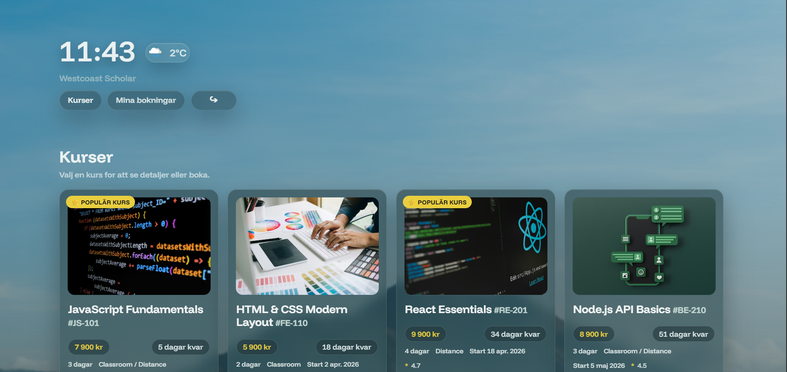

# Westcoast Scholar – Inlämningsuppgift 1

En mini-SaaS utbildningsplattform byggd i vanilla JavaScript (ES modules), Vite och JSON Server.



## Kom igång

### Krav
- Node.js installerat
- npm installerat

### Installation
```bash
npm install
```

Skapa en `.env`-fil baserad på `.env.example`:
```bash
cp .env.example .env
```

### Starta projektet

Öppna två terminaler:

**Terminal 1 – API:**
```bash
npm run api
```

**Terminal 2 – Frontend:**
```bash
npm run dev
```

Öppna sedan: `http://localhost:5173/index.html`

### Testkonton

| Roll    | E-post               | PIN  |
|---------|----------------------|------|
| Student | student@westcoast.se | 1234 |
| Teacher | teacher@westcoast.se | 4321 |

## Sidor

| Sida         | URL                                     |
|--------------|-----------------------------------------|
| Login        | http://localhost:5173/login.html        |
| Registrering | http://localhost:5173/register.html     |
| Kurser       | http://localhost:5173/courses.html      |
| Bokning      | http://localhost:5173/booking.html      |
| Admin        | http://localhost:5173/admin.html        |

## Funktionalitet

### Steg 1 – Kurser och bokning
- Kurslisting med bild, beskrivning, innehåll och lärarinfo
- Populära kurser markeras med badge
- Detaljvy expanderar kortet i gridet
- Bokningsformulär med validering
- Bokningshistorik för inloggad student

### Steg 2 – Admin (teacher)
- Skapa ny kurs via formulär
- Radera kurs med bekräftelse
- Se alla bokningar

### Autentisering
- Login med e-post och 4-siffrig PIN
- Registrering med rollval (student/teacher)
- SessionStorage-baserad auth // se AUTH.MD
- Rollskyddad navigation // Se AUTH.md

## Teknisk stack

| Verktyg     | Version  | Användning             |
|-------------|----------|------------------------|
| Vite        | 7.x      | Dev-server, bundler    |
| JSON Server | 0.17.4   | Mock REST API          |
| Vitest      | 4.x      | Enhetstester           |
| TypeScript  | 5.x      | Typning av utils-lager |
| Happy DOM   | 20.x     | DOM-miljö för tester   |

## TypeScript och tester

Logiken är skriven i TypeScript med full testtäckning:

| Fil                             | Innehåll                                            | Tester |
|---------------------------------|-----------------------------------------------------|--------|
| src/utils/courseUtils.ts        | Datumformatering, bildmatchning, bokningsvalidering | 18 st  |
| src/utils/courseAdminUtils.ts   | Kursvalidering, prisformatering, datumkontroll      | 13 st  |
```bash
npm test           # kör alla 31 tester
npm run typecheck  # tsc --noEmit, noll fel
```

## Projektstruktur
root/
├── public/           HTML och CSS
├── src/
│   ├── api/          API-anrop och app-bootstrap
│   ├── auth/         Auth-logik
│   ├── ui/           Render-funktioner
│   └── utils/        TypeScript helpers
├── db/
│   └── db.json       Mock-databas
├── vite.config.js
├── vitest.config.ts
├── tsconfig.json
└── package.json

## NPM-skript

| Skript              | Beskrivning                      |
|---------------------|----------------------------------|
| npm run dev         | Startar Vite dev-server          |
| npm run api         | Startar JSON Server port 3001    |
| npm test            | Kör alla Vitest-tester           |
| npm run typecheck   | Kör tsc --noEmit                 |
| npm run build       | Bygger projektet till dist/      |
